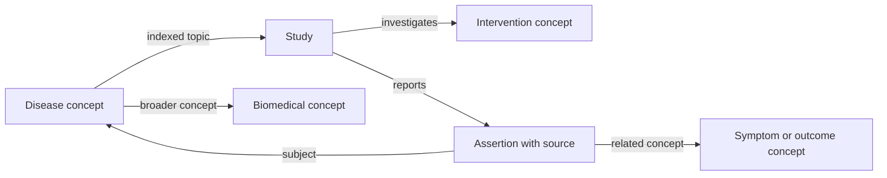

# Research knowledge graph and expanded research experience

Status: planned scope, 9 October 2026. The user selected **students and researchers exploring medical literature** as the first audience. This document adds a product and research roadmap; it does not claim that a graph, new corpus, hosted model API, or patient-aware model is implemented.

## Purpose

Expand MedOrchestrate into a literature exploration workbench where a user can start with a disease, symptom, intervention, question, or biomedical concept, explore related studies, and save a research collection. Retain the existing case mode as an optional research experiment. The central search and orchestration question remains: which combination of lexical retrieval, semantic retrieval, and graph exploration gives useful evidence within a measured resource budget?

The graph supplies a navigable map of concepts and study-backed assertions. It should make discovery and source inspection easier. A connected path is not automatically proof of causation, treatment benefit, or applicability to a patient.

## Why the current product feels small

- The public interactive search contains three fictional cases and twelve invented records. Repeated questions quickly return the same small set, and there are no real source pages to read from those records.
- The real NFCorpus benchmark and trained MiniLM model run separately through local commands. The public site displays their aggregate metrics, so the user cannot experience the research work through search.
- Case selection is the main entry point. A student often wants to explore a topic or compare papers without constructing a patient case first.
- The experience largely ends with ranked cards and an execution trace. It has no linked concept exploration, study comparison workspace, saved collections, or return-to-work history.
- Several views focus on methods, fixture checks, and limitations. This makes the software inspectable but gives the homepage the feel of an experiment dashboard.

The first build was intentionally a bounded demonstration; model training added research substance but did not expand the interactive product. The remedy is to connect real source content to meaningful follow-on actions and reorganize the entry flow around topics. Motion and richer visuals can support that experience, but they cannot provide missing evidence or breadth.

## What a user will do

1. Enter a topic or question on the homepage; a fictional case is optional.
2. See matching concepts and real linked studies. Resolve ambiguous terms before exploring further.
3. Open a bounded concept neighborhood showing diseases, symptoms, interventions, studies, and related biomedical concepts.
4. Click a study to inspect its citation, publication type, date, accessible source, and the concepts or assertions extracted from it.
5. Click a relationship to see its exact meaning, supporting study, permitted evidence passage or source location, extraction method, and review status.
6. Filter by publication year, source, study type, concept type, relation type, and reviewed versus automatically extracted assertions.
7. Add studies and concepts to a named research collection, compare selected studies, and export citations.

Illustrative structure (a proposed schema, not a medical factual claim):

The central screen pairs a graph with a study list and a detail panel. Selecting a graph node filters the list; selecting a study highlights its concepts. Users can switch to a keyboard-accessible list view and expand a small neighborhood rather than load a screen full of thousands of nodes.

## Graph contents and evidence rules

| Object | Examples of stored information | Meaning |
| --- | --- | --- |
| Disease, symptom, intervention, biomedical concept | Canonical ID, label, aliases, source vocabulary, vocabulary release | A normalized concept; a chemical becomes an intervention only when its role is supported |
| Study | PMID/PMCID/DOI where available, citation, date, publication type, source URL, license, record retrieval time | A source record, not a quality rating |
| Study-to-concept link | `MENTIONS`, `INDEXED_WITH`, or reviewed `INVESTIGATES` | Presence, indexing, or study focus; these are distinct |
| Vocabulary relation | `BROADER_THAN`, alias mapping | Terminology organization; not a clinical relationship |
| Reported assertion | Subject, predicate, object, study, source location, direction/negation, population/species where available, extractor version, review state | What one source reports, with its context |

Start with indexed topics, mentions, and vocabulary hierarchy. Add richer disease-symptom and intervention-disease assertions only when supported by a source and reviewed under an explicit policy. Two concepts appearing in the same paragraph are not sufficient to label an edge `TREATS`, `CAUSES`, or `HAS_SYMPTOM`. Multiple studies may disagree; store separate assertions and display the disagreement. Automatic extraction scores are model scores, not probabilities that a biomedical claim is true. Missing relationships mean unknown coverage, not proof of absence.

Every published relationship must have a stable ID, source type and ID, relation meaning, source version or retrieval date, creation method, and review state. An article-backed assertion also needs its publication date and evidence location. Retractions/corrections should have an update path and visible status rather than leave a claim silently unchanged.

## Data sources and rights

Use [NLM MeSH](https://www.nlm.nih.gov/databases/download/mesh.html) for canonical biomedical concepts and aliases. Its [terms](https://www.nlm.nih.gov/databases/download/terms_and_conditions_mesh.html) require source acknowledgment and current data or clear version identification; do not imply NLM endorsement. MeSH supplies terminology and indexing, not a complete disease-symptom-treatment fact base.

Use permitted study content through official PubMed/PMC or Europe PMC interfaces. Keep a per-record rights manifest. [NCBI's policies](https://www.ncbi.nlm.nih.gov/home/about/policies/) explain that PubMed abstracts may be copyrighted by publishers or authors. [PMC's Open Access subset](https://pmc.ncbi.nlm.nih.gov/tools/openftlist/) has varying licenses, so select an explicit compatible license subset and check each article before redistributing evidence text. Start the public graph with source IDs, links, allowed metadata, and only permitted passages. An API being publicly accessible does not give a blanket redistribution license.

[PubTator 3](https://pmc.ncbi.nlm.nih.gov/articles/PMC11223843/) provides biomedical entity and relation annotations and standardized identifiers. [Europe PMC annotations](https://europepmc.org/annotationsapi) are another candidate. Prefer existing annotations to training a new extractor in the first graph build. Verify supported types and source terms: neither should be assumed to cover every symptom, treatment role, or qualifier. Preserve provider provenance and place uncertain mappings or rich relations in a review queue.

Keep the existing NFCorpus benchmark and its raw files under their current local policy. It is an evaluation corpus, not a general public graph dataset. Do not derive a public graph by silently redistributing its texts or judgments.

## Connection to the trained retriever

Provide a separate research-search path using a permitted curated literature collection. Load the saved MiniLM weights locally, precompute and version document embeddings, and search those embeddings for a user question. Retain BM25 as a comparator and fixed hybrid as an optional route. The first model was trained on nutrition-focused NFCorpus queries; it may transfer poorly to other biomedical domains, so evaluate transfer instead of promising broad improvement.

Map the user's question and retrieved studies to graph concepts. Initially the graph explains and explores the same results without changing their order. Later test a graph-assisted route that uses a small, logged one- or two-hop neighborhood to expand concepts or find additional candidate studies. Show which terms and graph paths affected retrieval. Disease/symptom expansions must not be generated as patient diagnoses.

A knowledge graph does not require a graph neural network or an LLM in the first build. Entity normalization, supported annotations, explicit assertions, and a reliable interface provide the first useful increment. Graph-assisted retrieval, query rewriting, and a learned route controller become separate evaluated methods after the data and baseline are stable.

## Architecture and hosting

Use the existing Flask/Python backend, a small SQLite database for concepts/studies/assertions/provenance, and JSON graph exports for permitted public snapshots. Proposed endpoints are concept search, study details, bounded graph neighborhoods, research search, and collection export. Keep source fetches cached, rate-limited, versioned, and visibly dated. Secrets, if a provider needs them, belong in backend configuration.

Use [Cytoscape.js](https://js.cytoscape.org/) for the browser graph; it supports interaction and JSON graphs and has an MIT-licensed core. Pin a reviewed version during implementation. Render relation labels, meaningful focus/highlight states, loading progress, and optional motion with reduced-motion support. Begin with 20-50 visible nodes and explicit expansion controls.

GitHub Pages can host a permitted graph snapshot, interactive graph navigation, source links, and browser-local collections. It cannot run the Python retriever or server ingestion jobs. Local Flask can support dynamic ingestion and model inference first. A continuously updated shared service needs a separately deployed backend and a reviewed hosting/resource budget; no paid service is assumed by this plan.

## Delivery order and acceptance

| Milestone | Build | Acceptance |
| --- | --- | --- |
| 1. Real research search | Topic-first entry, a curated compatible-license pilot of roughly 150-300 studies across several topic areas, source links, local MiniLM/BM25 search, visible dataset coverage and freshness | Users can search real studies without selecting a case; valid source IDs/rights records; cached repeat search works; corpus embedding build and per-query costs recorded |
| 2. Concept-study graph | MeSH normalization, indexed/mention links, Cytoscape explorer, linked study list, list fallback | Synonyms resolve to stable concepts; uncertain mappings stay explicit; every edge has provenance; node/edge selection reveals its sources; graph remains usable on small screens |
| 3. Research workspace | Study details and comparison, local saved collections, citation export, exploration history | A user can complete and reopen a small literature exploration task and trace every exported study to its source |
| 4. Rich relations | Provider annotations, review workflow, contextual assertions, correction/retraction handling | Audit a held-out sample of entity mappings and rich relations; report errors and coverage; generic mentions remain distinct from asserted relationships |
| 5. Graph-assisted experiment | Graph expansion route alongside fixed lexical/dense/hybrid methods, resource logging, frozen dev and fresh holdout protocol | Report retrieval quality, unsupported expansion rates, costs, and per-query regressions; no assumption that a graph improves ranking |
| 6. Shared live service | Backend hosting, persisted project workspaces, bounded source refresh, monitoring and operational documentation | Confirm provider, operating budget, source rights, and deployment tests; public UI truthfully indicates which actions use live backend versus a dated snapshot |

The pilot limits the first data audit, not the product's entry options. The topic search and schema should accept additional domains through the same ingestion process instead of permanently hard-coding a few diseases.

## Evaluation and definition of done

Create a separately versioned graph evaluation set with held-out source documents and reviewed entity/relationship annotations. Measure entity-linking precision/recall, relation correctness including negation and population context, provenance completeness, broken links, and graph response/resource limits. Assess student research tasks such as finding supporting papers, distinguishing a mention from a claim, comparing two studies, and returning to saved work. Keep these usability outcomes separate from retrieval benchmark scores and clinical claims.

The first graph release is done when a student can start with a topic, inspect real linked studies, navigate supported concepts, examine each edge's evidence, and save a collection. Any inaccessible source, ambiguous entity, stale snapshot, or unreviewed assertion should be visible in context. Broader medical coverage, patient-aware evaluation, and additional model training remain measured future extensions.
