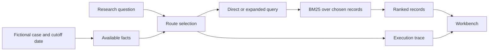

# MedOrchestrate Project Guide

## What this project is

MedOrchestrate is a **research prototype for patient-aware medical literature retrieval**. A user chooses a fictional case, selects the date on which facts are allowed to be known, and asks a research question. The system chooses or accepts a search route, ranks matching records, and shows the route, query changes, source metadata, and execution calls.

The long-term research question is whether selecting a retrieval strategy from a question and relevant patient facts can improve document relevance, or preserve relevance while doing less work, compared with a strong fixed strategy. **The Stage 1 demonstration, Stage 2 fixed BM25 benchmark, and first trained MiniLM comparison do not answer that patient-aware question.** Stage 1 proves the workflow runs; the real NFCorpus runs evaluate literature retrieval without patient context.

MedOrchestrate does not diagnose a patient, select a treatment, prescribe medication, or evaluate clinical outcomes. It accepts no real patient records in this build.

## The two versions in this repository

| Version | Purpose | Where it runs | Data and limits |
| --- | --- | --- | --- |
| Local workbench | Stage 1 Python/Flask workbench, Stage 2 fixed BM25, optional trained MiniLM comparison, and local citation import | `start.cmd`, `python launch.py`, or benchmark/training CLI | Fictional demo remains separate from locally downloaded BEIR NFCorpus data and locally saved model weights |
| GitHub Pages demo | Public, browser-only presentation of the fictional Stage 1 workflow and read-only aggregate research cards | GitHub Pages from `site/` | Fictional interactive fixture; no Python server, model inference, benchmark text, or local citation import |

The [live public demo](https://siddharthvd.github.io/MedOrchestrate-Stage1/) and the local workbench make the same core route decisions on the same fictional inputs. GitHub Pages is a static host and does not run the Flask API.

## How the current workflow works



1. **Case and date.** The case loader returns only facts with an availability date on or before the chosen date. The API accepts canonical `YYYY-MM-DD` dates to prevent ambiguous comparisons.
2. **Query.** The user enters a research question. Deterministic expansion may append search terms from available fictional facts. It does not generate medical advice.
3. **Route.** Direct BM25 uses the entered question. Expanded BM25 uses the additional terms. The adaptive rule selects expansion for a short question with available facts; otherwise it selects direct BM25. This rule is inspectable and is **not a trained controller**.
4. **Retrieval.** BM25 ranks records whose publication date is eligible by the cutoff. In the default fixture these records are invented; their titles and abstracts are software test material.
5. **Trace.** The response records the requested and executed route, rationale, added terms, facts used, eligible record count, elapsed local time, and route calls.

### Example

Choose the fictional type 2 diabetes case on `2026-10-08` and ask: “What evidence discusses glucose lowering treatment in type 2 diabetes?” The adaptive rule selects expanded BM25 because this is a short question with available facts. Its trace shows which terms were added and which invented records ranked. Changing the case date to `2026-03-01` excludes the albuminuria fact, which was marked available only from `2026-09-01`.

## What is implemented now

- Five workbench views: Dashboard, Case Explorer, Evidence Search, Route Comparison, and Research Evaluation.
- Direct BM25, deterministic expansion plus BM25, and a transparent rule-selected route.
- Date validation for case facts and source records, plus rejection of malformed API requests.
- An optional local importer for user-supplied citation metadata. It checks required fields, dates, IDs, source type, and URL shape; **it does not verify publication authenticity, license, full text, or clinical applicability**.
- A small fixture evaluation with six hand-labeled questions about the 12 invented records. It computes Recall@5, MRR@5, and nDCG@5 as software checks.
- Saved tests and HTTP smoke artifacts under `artifacts/demo/`.
- A local Stage 2 BEIR-format benchmark path with pinned NFCorpus archive and file hashes, validated train/dev/test query separation, fixed direct BM25, TREC run output, and aggregate Recall/MRR/nDCG. The benchmark data and raw run files stay outside Git; [the protocol](../research/STAGE2_PROTOCOL.md) records source terms and reproduction steps.
- An optional local MiniLM training command and locked dev/test comparison across BM25, untuned dense, trained dense, and a fixed hybrid. The [training report](../research/TRAINING_RUN.md) records real weights, observed metrics, costs, hashes, and limitations; weights and raw rankings stay local.

## How to run and verify it

For the local workbench on Windows, double-click `start.cmd` and keep the terminal open. Alternatively:

```powershell
python -m pip install -r requirements.txt
python launch.py
```

Open `http://127.0.0.1:8000/` in a browser. To run the automated checks:

```powershell
python -m unittest discover -s tests -v
node --check static/app.js
python -m medorchestrate.evaluate --output artifacts/demo/fixture_evaluation.json
```

The [faculty walkthrough](final_demo_guide.md) gives a specific case, question, route, and offline backup. The [audit](audit_report.md) and [progress record](presentation_progress.md) distinguish verified behavior from plans.

## What the current results mean

The 12 records and six relevance judgments were created for the software fixture. A ranking difference or fixture metric can show that two routes behave differently and that the metric code runs. Stage 2 and the trained MiniLM run use a real literature benchmark, but its queries have no dated patient facts, so their scores cannot measure the patient-aware hypothesis or clinical usefulness. Local wall time is a machine observation, not an API cost or a comparable benchmark cost.

The laptop check recorded roughly 16.8 GB total RAM and 10.5 GB free disk at the Stage 1 checkpoint; GPU runtime support was not established. That is why Stage 1 uses CPU-friendly lexical retrieval and no large model download.

## Future scope and research gates

| Gate | Work to complete | Evidence needed before moving on |
| --- | --- | --- |
| 2. Corpus and protocol — implemented | Use the BEIR NFCorpus transformed edition locally; pin source rights, archive and file hashes, split IDs, and a fixed lexical evaluation | Local frozen manifest, compatible train/dev/test qrels, raw BM25 rankings, and aggregate metrics; no fixture labels reused or source data republished |
| 3. First trained retrieval comparison — implemented | Train a small dense retriever on NFCorpus train and compare BM25, untuned dense, trained dense, and a fixed hybrid | Saved local weights, frozen dev selection, test TREC runs/hashes, aggregate metrics and resource observations; broader training and independent holdout remain |
| 4. Rewriting feasibility | Check query fidelity and small local model runtime; consider a base rewriter and LoRA only if data and hardware allow | Valid train/dev/test separation, faithful rewrites, and actual adapter weights/logs if trained |
| 5. Adaptive controller | Compare rules, question-only learning, patient-aware learning, and a seeded diagnostic while counting all probes and fallbacks | Training-only fitting, development calibration, traceable total execution cost, no locked-test tuning |
| 6. Formal evaluation | Freeze the comparator and run the locked test, uncertainty analysis, ablations, and failure review | Raw rankings and manifests for every numerical result; patient-aware synthetic results reported separately |
| 7. Manuscript | Write methods and results tied to real runs and verified literature | Reproducible figures, citations, limitations, and no unsupported clinical claim |

[NFCorpus in BEIR](https://github.com/beir-cellar/beir) is the selected Stage 2 package. The [original owner](https://www.cl.uni-heidelberg.de/statnlpgroup/nfcorpus/) permits academic use but does not clearly grant public redistribution, so the real files remain local. NFCorpus studies retrieval for its own queries and does not supply patient-specific judgments. See the [frozen protocol](../research/STAGE2_PROTOCOL.md).

## Smallest useful next steps

1. Preserve the fixed Stage 2 BM25 result and raw local TREC run as a checkpoint; repeat it after any tokenizer or ranking change.
2. Preserve the first MiniLM checkpoint and frozen comparison. Repeat with more train queries, multiple seeds and a new independent holdout before a stronger performance claim.
3. Measure end-to-end inference including model load and both hybrid calls; decide whether the quality gain justifies the CPU cost.
4. Obtain a separate, appropriately governed patient-aware question set with independent relevance judgments before training or evaluating a patient-aware controller.

## Project map

| Path | Role |
| --- | --- |
| `medorchestrate/` | Flask routes, corpus validation, lexical retrieval, fixture evaluation |
| `data/` | Fictional cases and demo qrels; ignored `data/benchmark/` holds the local real benchmark |
| `templates/`, `static/` | Local five-view workbench |
| `site/` | GitHub Pages version of the fictional demo |
| `tests/` | Python API and retrieval regression tests |
| `artifacts/demo/` | Actual Stage 1 smoke outputs and environment snapshot |
| `artifacts/benchmark/` | Aggregate Stage 2 metrics and input/run provenance without benchmark text |
| `artifacts/training/` | Aggregate trained-retrieval metrics, model/config hashes, and selection provenance without model weights |
| `docs/` | Audit, demo guide, decisions, progress, and this guide |
| `research/`, `scripts/` | Benchmark protocol, source selection, and verified local download utility |

The original [handoff document](MedOrchestrate_Codex_Handoff.docx) describes the broader target. A listed future feature is not implemented merely because it appears in that specification.
