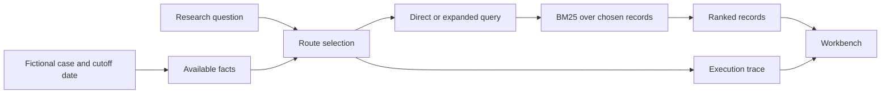

# MedOrchestrate Project Guide

## What this project is

MedOrchestrate is a **research prototype for patient-aware medical literature retrieval**. A user chooses a fictional case, selects the date on which facts are allowed to be known, and asks a research question. The system chooses or accepts a search route, ranks matching records, and shows the route, query changes, source metadata, and execution calls.

The long-term research question is whether selecting a retrieval strategy from a question and relevant patient facts can improve document relevance, or preserve relevance while doing less work, compared with a strong fixed strategy. **The current Stage 1 demonstration does not answer that question.** It proves that the basic workflow runs and can be inspected.

MedOrchestrate does not diagnose a patient, select a treatment, prescribe medication, or evaluate clinical outcomes. It accepts no real patient records in this build.

## The two versions in this repository

| Version | Purpose | Where it runs | Data and limits |
| --- | --- | --- | --- |
| Local workbench | Full Stage 1 Python/Flask implementation, local citation import, API, tests, and fixture evaluation | `start.cmd` or `python launch.py` | Three fictional cases; 12 invented records; optional locally supplied citation metadata is format checked but not authenticated |
| GitHub Pages demo | Public, browser-only presentation of the fictional Stage 1 workflow | GitHub Pages from `site/` | Fictional fixture only; no Python server or local citation import |

The [live public demo](https://siddharthvd.github.io/MedOrchestrate-Stage1/) and the local workbench make the same core route decisions on the same fictional inputs. GitHub Pages is a static host and does not run the Flask API.

## How the current workflow works



1. **Case and date.** The case loader returns only facts with an availability date on or before the chosen date. The API accepts canonical `YYYY-MM-DD` dates to prevent ambiguous comparisons.
2. **Query.** The user enters a research question. Deterministic expansion may append search terms from available fictional facts. It does not generate medical advice.
3. **Route.** Direct BM25 uses the entered question. Expanded BM25 uses the additional terms. The adaptive rule selects expansion for a short question with available facts; otherwise it selects direct BM25. This rule is inspectable and is **not a trained controller**.
4. **Retrieval.** BM25 ranks records whose publication date is eligible by the cutoff. In the default fixture these records are invented; their titles and abstracts are software test material.
5. **Trace.** The response records the requested and executed route, rationale, added terms, facts used, eligible record count, elapsed local time, and route calls.

### Example

Choose the fictional type 2 diabetes case on `2026-10-08` and ask: “What evidence discusses glucose lowering treatment in type 2 diabetes?” The adaptive rule selects expanded BM25 because this is a short question with available facts. Its trace shows which terms were added and which invented records ranked. Changing the case date to `2026-03-01` excludes the albuminuria fact, which was marked available only from `2026-09-01`.

## What is implemented now

- Five workbench views: Dashboard, Case Explorer, Evidence Search, Route Comparison, and Research Evaluation.
- Direct BM25, deterministic expansion plus BM25, and a transparent rule-selected route.
- Date validation for case facts and source records, plus rejection of malformed API requests.
- An optional local importer for user-supplied citation metadata. It checks required fields, dates, IDs, source type, and URL shape; **it does not verify publication authenticity, license, full text, or clinical applicability**.
- A small fixture evaluation with six hand-labeled questions about the 12 invented records. It computes Recall@5, MRR@5, and nDCG@5 as software checks.
- Saved tests and HTTP smoke artifacts under `artifacts/demo/`.

## How to run and verify it

For the local workbench on Windows, double-click `start.cmd` and keep the terminal open. Alternatively:

```powershell
python -m pip install -r requirements.txt
python launch.py
```

Open `http://127.0.0.1:8000/` in a browser. To run the automated checks:

```powershell
python -m unittest discover -s tests -v
node --check static/app.js
python -m medorchestrate.evaluate --output artifacts/demo/fixture_evaluation.json
```

The [faculty walkthrough](final_demo_guide.md) gives a specific case, question, route, and offline backup. The [audit](audit_report.md) and [progress record](presentation_progress.md) distinguish verified behavior from plans.

## What the current results mean

The 12 records and six relevance judgments were created for this software fixture. A ranking difference or fixture metric can show that two routes behave differently and that the metric code runs. It cannot show that a route retrieves better real biomedical literature, benefits patients, or is clinically safe. Local wall time is a machine observation, not an API cost or a comparable benchmark cost.

The laptop check recorded roughly 16.8 GB total RAM and 10.5 GB free disk at the Stage 1 checkpoint; GPU runtime support was not established. That is why Stage 1 uses CPU-friendly lexical retrieval and no large model download.

## Future scope and research gates

| Gate | Work to complete | Evidence needed before moving on |
| --- | --- | --- |
| 2. Corpus and protocol | Select a permitted public biomedical retrieval dataset; define the task, license, edition, corpus, queries, qrels, partitions, hashes, and budgets | Versioned provenance manifest and compatible qrels; no fixture labels reused |
| 3. Strong fixed retrieval | Implement and compare BM25, feasible dense retrieval, and a fixed hybrid strategy with one shared ranking policy | Repeatable rankings, full route call logs, resource measures, and development-set comparisons |
| 4. Rewriting feasibility | Check query fidelity and small local model runtime; consider a base rewriter and LoRA only if data and hardware allow | Valid train/dev/test separation, faithful rewrites, and actual adapter weights/logs if trained |
| 5. Adaptive controller | Compare rules, question-only learning, patient-aware learning, and a seeded diagnostic while counting all probes and fallbacks | Training-only fitting, development calibration, traceable total execution cost, no locked-test tuning |
| 6. Formal evaluation | Freeze the comparator and run the locked test, uncertainty analysis, ablations, and failure review | Raw rankings and manifests for every numerical result; patient-aware synthetic results reported separately |
| 7. Manuscript | Write methods and results tied to real runs and verified literature | Reproducible figures, citations, limitations, and no unsupported clinical claim |

[NFCorpus in BEIR](https://github.com/beir-cellar/beir) is a candidate for the next corpus gate. Its exact terms and dataset edition must be checked before use. It studies retrieval of biomedical articles for its own queries; it does not by itself supply patient-specific judgments. See [benchmark candidate notes](../research/benchmark_candidates.md).

## Smallest useful next steps

1. Confirm the public Pages demo and local workbench both work on the same fictional case, date, and question. Save a screenshot of each view when browser access permits.
2. Freeze Stage 1 as a reproducible checkpoint with tests, raw outputs, and this guide.
3. Verify one public benchmark's original source, terms, edition, corpus, and qrels. Record the exact task and the limits of its judgments.
4. Build and measure a strong fixed BM25 baseline on that benchmark before adding neural routes or training a controller.

## Project map

| Path | Role |
| --- | --- |
| `medorchestrate/` | Flask routes, corpus validation, lexical retrieval, fixture evaluation |
| `data/` | Fictional cases, invented records, and demo-only qrels |
| `templates/`, `static/` | Local five-view workbench |
| `site/` | GitHub Pages version of the fictional demo |
| `tests/` | Python API and retrieval regression tests |
| `artifacts/demo/` | Actual Stage 1 smoke outputs and environment snapshot |
| `docs/` | Audit, demo guide, decisions, progress, and this guide |
| `research/` | Candidate benchmark and protocol notes |

The original [handoff document](MedOrchestrate_Codex_Handoff.docx) describes the broader target. A listed future feature is not implemented merely because it appears in that specification.
